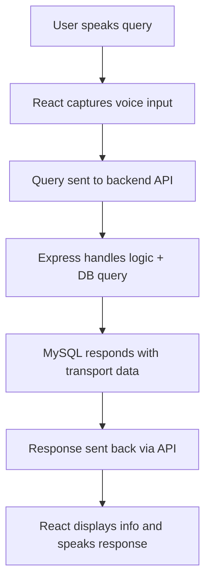

# 🚌 Voice-based Transport Enquiry System

Voice-enabled transport inquiry system built as a university project (CSE302 – DBMS course).  
Leverages a **React** front-end, **Node.js** back-end with **Express**, and a **MySQL** database to provide voice-driven access to transport information.

---

## 🚀 Stack & Components

- **Frontend**: React (in `VoiceEnquirySystem/`)
- **Backend**: Node.js + Express (in `voiceenquirybackend/`)
- **Database**: MySQL (configure via `SQL COMMANDS.txt`)

---

## 📦 Installation & Setup

```bash
# 1. Clone the repository
git clone https://github.com/Aditya-hub2k03/Voice-based-Transport-Enquiry-System.git
cd Voice-based-Transport-Enquiry-System

# 2. Set up the backend
cd voiceenquirybackend
npm install
# Update DB connection in server.js
# Execute SQL in `SQL COMMANDS.txt`

# 3. Set up the frontend
cd ../VoiceEnquirySystem
npm install

# 4. Launch app:
# - Backend:
cd ../voiceenquirybackend
node server.js   # default port: 3000

# - Frontend:
cd ../VoiceEnquirySystem
npm start       # default port: 3000 or 5173, depending on setup
```

---

## 🛠 How It Works



---

## 🗂 Project Structure

```
Voice-based-Transport-Enquiry-System/
├── voiceenquirybackend/
│   ├── server.js
│   ├── SQL COMMANDS.txt
│   └── ...
├── VoiceEnquirySystem/
│   ├── [React app files]
│   └── ...
├── README.md
└── ...
```

---


## 🤝 Contributing

Contributions are very welcome! Here's how you can help:

1. **Open an Issue** to suggest features or report problems  
2. **Submit a Pull Request** with improvements or fixes

---

